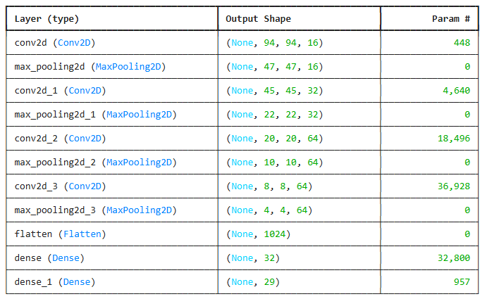

# Sign Language Interpreter using CNN & TensorFlow Lite

A deep learning-based Sign Language Interpreter that recognizes hand gestures representing the English alphabet (A–Z). This project combines **CNN**, **transfer learning**, and **TensorFlow Lite** for accurate and lightweight sign recognition — ready for real-time deployment.



---

## Project Overview

| File/Folder                 | Description                                              |
|----------------------------|----------------------------------------------------------|
| `Explomodeltraining.ipynb` | Jupyter Notebook for model training and evaluation       |
| `asl_cnn_model4_int8.tflite` | Optimized model for mobile deployment using TFLite       |
| `Architecture.png`         | Model architecture diagram                              |
| `Project_report.pdf`       | Detailed report including methodology and results        |
| `Presentation Deck.pdf`    | Presentation slides for the project                     |

---

## Objectives

- Build a CNN model to recognize static ASL signs (A–Z)
- Preprocess image data for training (resize, grayscale, normalization)
- Optimize model for mobile using TensorFlow Lite quantization
- Prepare the model for deployment on real-time platforms

---

## Tech Stack

- `Python`
- `TensorFlow & Keras`
- `OpenCV`
- `NumPy / Pandas`
- `Matplotlib`
- `TensorFlow Lite`

---

## Dataset

- Dataset: American Sign Language (ASL) Alphabet Dataset
- Total Classes: **26 (A–Z)**
- Input Image Size: **64x64 grayscale**
- Preprocessing: Normalization, Resizing, Data Augmentation

---

## Model Architecture

A custom CNN with the following:
- 3 Convolutional layers + MaxPooling
- Dropout layers to prevent overfitting
- Dense layers with `softmax` activation
- Final model exported as `.tflite` with quantization

📈 **Accuracy Achieved**: ~96%

> See `Architecture.png` for the full structure.

---

## Model Optimization (TFLite)

Model converted for mobile deployment:
```python
converter = tf.lite.TFLiteConverter.from_keras_model(model)
converter.optimizations = [tf.lite.Optimize.DEFAULT]
tflite_model = converter.convert()

