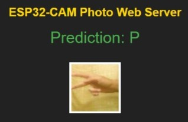
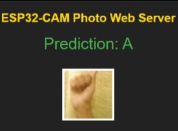

# ESP 32 based Sign Language Interpreter (Using CNN & TensorFlow Lite)

### A Deep Learning-based Sign Language Interpreter using the ESP-32 CAM that recognizes hand gestures representing the English alphabet (A–Z). This project combines **CNN**, **transfer learning**, and **TensorFlow Lite** for accurate and lightweight sign recognition — ready for real-time deployment.


---

## Project Overview

| File/Folder                 | Description                                              |
|----------------------------|----------------------------------------------------------|
| `Explomodeltraining.ipynb` | Jupyter Notebook for model training and evaluation       |
| `asl_cnn_model4_int8.tflite` | Optimized model for mobile deployment using TFLite       |
| `Architecture.png`         | Model architecture diagram                              |
| `Project_report.pdf`       | Detailed report including methodology and results        |
| `Presentation Deck.pdf`    | Presentation slides for the project                     |

---

## Objectives

- Gathered a labeled dataset of American Sign Language hand gestures representing the 26 English alphabets for model training and testing.
- Resized all images to a fixed size for consistency, converted them to grayscale to reduce complexity, and normalized pixel values (0–1) to help the model train faster and more efficiently.
- To make the model run faster and use less memory on mobile devices, it was converted to TensorFlow Lite format. Then, quantization was applied to shrink the model by using smaller, more efficient numbers—without losing much accuracy
- Set up the optimized model to work smoothly in real-time environments, like mobile or embedded systems. Tested it with live inputs to ensure it could make quick and accurate predictions, ready for use in real-world applications.

---

## Dataset

- Dataset: American Sign Language (ASL) Alphabet Dataset, containing labeled static images for each of the 26 English alphabets represented through hand gestures.
- Total Classes: 26 (A–Z), one for each letter of the English alphabet.
- Input Image Size: All images were resized to 64x64 pixels and converted to grayscale to simplify processing.
- **Preprocessing**: 
  - Normalization: Pixel values scaled between 0 and 1.
  - Resizing: Standardized input dimensions for CNN.
  - Data Augmentation: Techniques like flipping, rotation, and zoom to improve generalization.

- **Tech Stack**
  - `Python`
  - `TensorFlow & Keras`
  - `OpenCV`
  - `NumPy / Pandas`
  - `Matplotlib`
  - `TensorFlow Lite`

---

## Model Architecture

The model is a custom CNN designed specifically to recognize ASL alphabets from images.  

- It starts with **three convolutional layers** that help the model learn important patterns and features from the hand signs.
- **MaxPooling layers** follow each convolution to reduce the image size and focus on the most useful information.
- **Dropout layers** are added to avoid overfitting, so the model performs well even on new, unseen images.
- After that, **dense (fully connected) layers** help in making the final decision, ending with a **softmax activation** to classify the image into one of the 26 letters.
- Once trained, the model is converted into a **`.tflite` format with quantization**, making it smaller and faster—perfect for running on mobile devices.


📈 **Accuracy Achieved**: ~96%


---
## Results

The model was tested in real-time using an ESP32-CAM and was able to accurately recognize ASL signs from live input.

### Prediction Examples

- **Prediction: A**  
  

- **Prediction: P**  
  


## Model Optimization (TFLite)

Model converted for mobile deployment:
```python
converter = tf.lite.TFLiteConverter.from_keras_model(model)
converter.optimizations = [tf.lite.Optimize.DEFAULT]
tflite_model = converter.convert()

